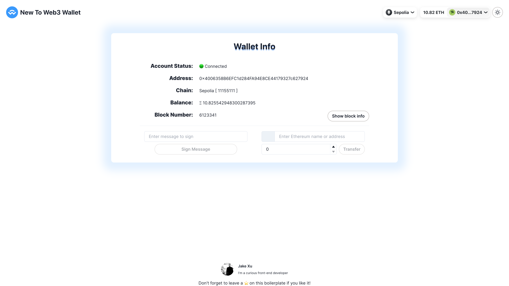

# New To Web3 Wallet

A simple and minimalist Web3 boilerplate to boost your Dapp development. Built using the latest technology stack out there: [Next.js](https://nextjs.org/), [Viem](https://viem.sh/), [Wagmi](https://wagmi.sh/), [RainbowKit](https://www.rainbowkit.com/), [ChakraUI](https://chakra-ui.com/), and [Typescript](https://www.typescriptlang.org/). 

[![nextjs]][nextjsURL]
[![viem]][viemURL]
[![wagmi]][wagmiURL]
[![rainbowkit]][rainbowkitURL]
[![chakraui]][chakrauiURL]
[![typescript]][typescriptURL]
[![prettier]][prettierURL]
[![ESLint]][eslintURL]

## Features ⚡

- [x] Web3 Wallet Status (MetaMask / Rainbow / Coinbase Wallet / WalletConnect)
- [x] Chain selector
- [x] Block Number / Chain ID & Name
- [x] Wallet balance
- [x] Sign Messages & Transfer Native
- [x] Block Detail Info
- [x] Hook to query user's Token Balances
- [x] Dark mode support



---

## How to use 🤔

To get started with this boilerplate, you just need to follow these simple steps:

1. Clone the repository:

   ```
   git clone https://github.com/JakeXu/new-to-web3-wallet.git
   ```

2. Install dependencies:

   ```
   yarn install
   # or
   pnpm install
   # or
   npm install
   # or
   bun install
   ```

3. Move `.env.example` file to `.env` and add the values for the following keys:

   ```
    NEXT_PUBLIC_WALLET_CONNECT_PROJECT_ID=
   ```

4. Run locally

   ```
   yarn dev
   # or
   pnpm dev
   # or
   npm dev
   # or
   bun dev
   ```

## Series
- [Upgrade Contract](./scripts/upgrade/)
- [Front Running](./scripts/frontrunning/README.md)
- [EIP712](./contracts/eip712/README.md)
- [Create2](./contracts/create2/README.md)
- Uniswap V2
  - [Add Liquidity](./contracts/uniswapv2/README-Liquidity.md)

### License

By [MIT licensed](./LICENSE).

[nextjs]: https://img.shields.io/badge/Next.js_v14.2-000000?style=for-the-badge&logo=next.js&logoColor=FFFFFF
[nextjsURL]: https://nextjs.org/
[typescript]: https://img.shields.io/badge/typescript-375BD2?style=for-the-badge&logo=typescript&logoColor=61DAFB
[typescriptURL]: https://www.typescriptlang.org/
[chakraui]: https://img.shields.io/badge/ChakraUI-purple?style=for-the-badge&logo=ChakraUI&logoColor=319795
[chakrauiURL]: https://chakra-ui.com/
[wagmi]: https://img.shields.io/badge/Wagmi-35324a?style=for-the-badge&logo=Wagmi
[wagmiURL]: https://wagmi.sh/
[rainbowkit]: https://img.shields.io/badge/Rainbowkit-006600?style=for-the-badge&logo=rainbowkit
[rainbowkitURL]: https://github.com/rainbow-me/rainbowkit
[viem]: https://img.shields.io/badge/Viem-ffc517?style=for-the-badge&logo=viem
[viemURL]: https://viem.sh/
[prettier]: https://img.shields.io/badge/Prettier-360D3A?style=for-the-badge&logo=Prettier&logoColor=61DAFB
[prettierURL]: https://prettier.io/
[eslint]: https://img.shields.io/badge/ESLint-4B32C3?style=for-the-badge&logo=ESLint&logoColor=61DAFB
[eslintURL]: https://eslint.org/
