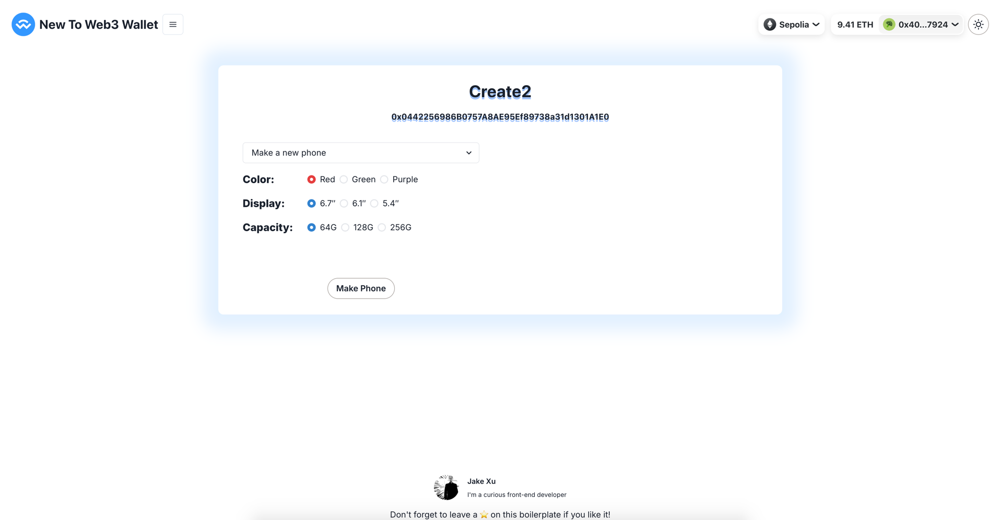
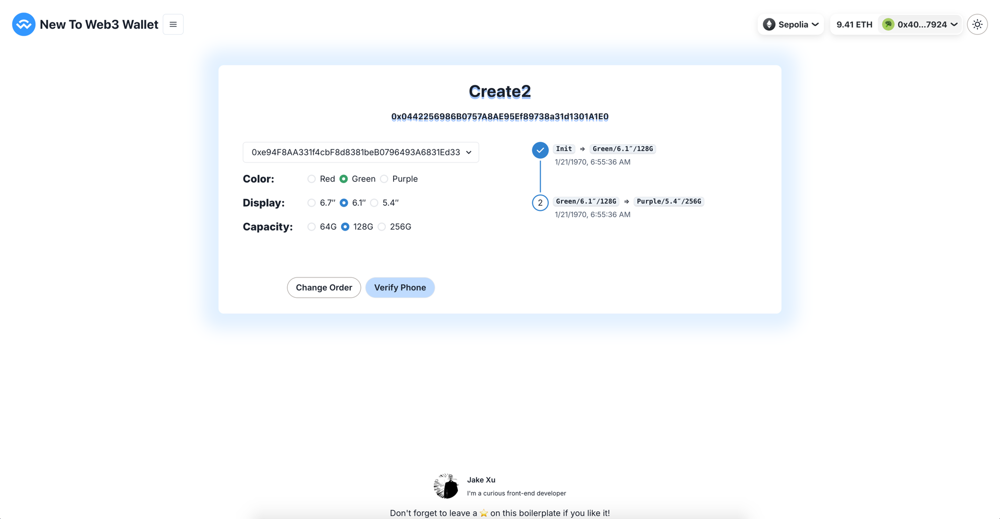

# Create2

You can use `create2` to generate the contract address in advance. This demo will show you step by step.

[![solidity]][solidityURL]
[![ethers]][ethersURL]

## Features ⚡

- [x] Demo contract
- [x] Deploy script
- [x] Make phone
- [x] Change order
- [x] Verify address



---

## How to use 🤔

To get started with this boilerplate, you just need to follow these simple steps:

1. Deploy demo contract with script

   ```
   npx hardhat run --network sepolia scripts/create2/deploy_create2.js
   ```

2. Make Phone / Change Order
   

3. Verify address
   > Change Color/Display/Capacity will get different address 
   
### License

By [MIT licensed](../../LICENSE).

[solidity]: https://img.shields.io/badge/Solidity-000000?style=for-the-badge&logo=solidity&logoColor=FFFFFF
[solidityURL]: https://nextjs.org/
[ethers]: https://img.shields.io/badge/Ethers-6790df?style=for-the-badge&logo=ethers
[ethersURL]: https://docs.ethers.org/v6/
