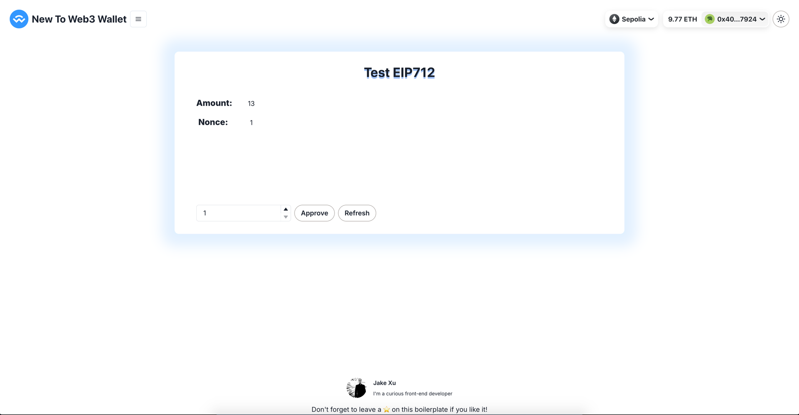
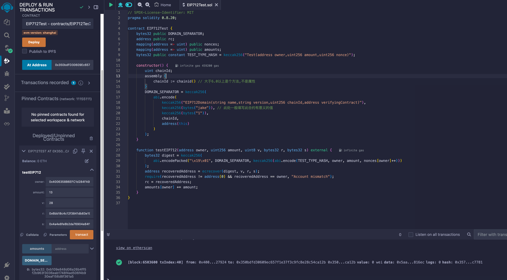

# EIP712

https://github.com/0xProject/EIPs/blob/master/EIPS/eip-712.md

Signing data is a solved problem if all we care about are bytestrings. Unfortunately in the real world we care about complex meaningful messages. Hashing structured data is non-trivial and errors result in loss of the security properties of the system.

[![solidity]][solidityURL]
[![ethers]][ethersURL]
[![remix]][remixURL]

## Features ⚡

- [x] Demo contract
- [x] Deploy script



---

## How to use 🤔

To get started with this boilerplate, you just need to follow these simple steps:

1. Deploy demo contract with script

   ```
   npx hardhat run --network sepolia scripts/eip712/deploy_eip712_test.js
   ```

2. Connect to MetaMask in Remix


3. Click the `At Address` button to point the newly deployed contract address to the contract instance


4. Call `signTypedDataAsync` to get account signature

   ```
   node scripts/frontrunning/frontrunning.js
   ```
   
5. Fetch `R/S/V` from signature and call `testEIP712` function successfully
   

### License

By [MIT licensed](../../LICENSE).

[solidity]: https://img.shields.io/badge/Solidity-000000?style=for-the-badge&logo=solidity&logoColor=FFFFFF
[solidityURL]: https://nextjs.org/
[ethers]: https://img.shields.io/badge/Ethers-6790df?style=for-the-badge&logo=ethers
[ethersURL]: https://docs.ethers.org/v6/
[remix]: https://img.shields.io/badge/Remix-007aa6?style=for-the-badge
[remixURL]: https://remix.ethereum.org/
