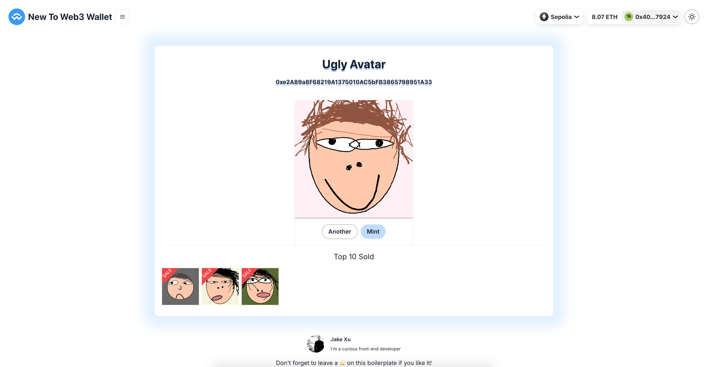

# NFT (ERC-721)

ERC stands for Ethereum Request for Comment, and 721 is the proposal identifier number. ERCs are application-level standards in the Ethereum ecosystem, they can be a smart contract standard for tokens such as ERC-20, the author of an ERC is responsible for building consensus with the Ethereum community, and once the proposal is reviewed and approved by the community, it becomes a standard. You can track the recent ERC proposal [here](https://github.com/ethereum/EIPs/issues).

[![solidity]][solidityURL]
[![ethers]][ethersURL]
[![remix]][remixURL]

## Features ⚡

- [x] Demo contract
- [x] Deploy script
- [x] Ugly Avatar
- [x] Mint NFT



---

## How to use 🤔

To get started with this boilerplate, you just need to follow these simple steps:

1. Deploy demo contract with script

   ```
   npx hardhat run --network sepolia scripts/erc721/deploy_erc721.js
   ```

2. Create API Key on [Pinata](https://app.pinata.cloud/)


3. Operate and observe data changes to understand contract features
`
### License

By [MIT licensed](../../LICENSE).

[solidity]: https://img.shields.io/badge/Solidity-000000?style=for-the-badge&logo=solidity&logoColor=FFFFFF
[solidityURL]: https://nextjs.org/
[ethers]: https://img.shields.io/badge/Ethers-6790df?style=for-the-badge&logo=ethers
[ethersURL]: https://docs.ethers.org/v6/
[remix]: https://img.shields.io/badge/Remix-007aa6?style=for-the-badge
[remixURL]: https://remix.ethereum.org/
