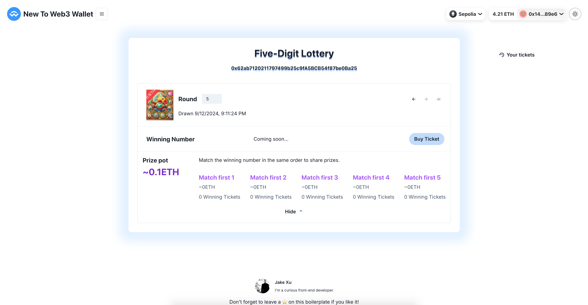

# Lottery (ERC-1155)

[ERC1155](https://eips.ethereum.org/EIPS/eip-1155) is a multi-token standard that allows the creation of fungible, non-fungible, and semi-fungible tokens all in one contract. Before ERC1155, if a use case needed both ERC20 (fungible) and ERC721 (non-fungible) tokens, then separate contracts were required to achieve this. ERC1155 also allows for multiple NFT collections to be launched in just one smart contract instead of creating a different contract for each collection; this increases efficiency in smart contract construction and minimizes the transaction count, which is very important as it consumes less blockchain space. With ERC1155, batch transfer of tokens is also possible instead of transferring a token to a single address in previous standards.

[![solidity]][solidityURL] [![ethers]][ethersURL] [![remix]][remixURL]

## Features ⚡

- [x] Demo contract
- [x] Deploy script
- [x] Crontab script
- [x] Create new lotto [For owner]
- [x] Draw winning numbers [For owner]
- [x] Buy lotto ticket
- [x] Claim reward
- [x] Withdraw all [For owner]
- [x] Generate random number [For Lottery]
- [x] Mint NFT



---

## How to use 🤔

To get started with this boilerplate, you just need to follow these simple steps:

1. Upload demo NFT logo for use on [Pinata](https://app.pinata.cloud/)

2. Deploy demo contract with script

   ```
   npx hardhat run --network sepolia scripts/gambling/deploy_lottery.js
   ```

3. Operate and observe data changes to understand contract features
   1. Create new lotto
   2. Buy ticket
   3. Draw winning numbers
   4. Claim reward

4. Write workflows to automate lotto creation and draws with [GitHub Actions](https://docs.github.com/en/actions)
   > Since each operation consumes ETH, these functions are moved to the UI for easy operation.
   ```yaml
   name: Create New Lotto and Draw Winning Numbers
   
   on:
     schedule:
       # 第一个定时任务: 每周一早上1点
       - cron: "0 1 * * 1"
       # 第二个定时任务: 每周六早上1点
       - cron: "0 1 * * 6"
   
   jobs:
     job1:
       name: Create New Lotto
       runs-on: ubuntu-latest
       steps:
         - name: Check out repository
           uses: actions/checkout@v3
   
         - name: Run daily task
           run: npx hardhat run --network sepolia scripts/gambling/new_lotto.js
   
     job2:
       name: Draw Winning Numbers
       runs-on: ubuntu-latest
       steps:
         - name: Check out repository
           uses: actions/checkout@v3
   
         - name: Run weekly task
           run: npx hardhat run --network sepolia scripts/gambling/draw_winning_numbers.js
   ```

### License

By [MIT licensed](../../LICENSE).

[solidity]: https://img.shields.io/badge/Solidity-000000?style=for-the-badge&logo=solidity&logoColor=FFFFFF
[solidityURL]: https://nextjs.org/
[ethers]: https://img.shields.io/badge/Ethers-6790df?style=for-the-badge&logo=ethers
[ethersURL]: https://docs.ethers.org/v6/
[remix]: https://img.shields.io/badge/Remix-007aa6?style=for-the-badge
[remixURL]: https://remix.ethereum.org/
