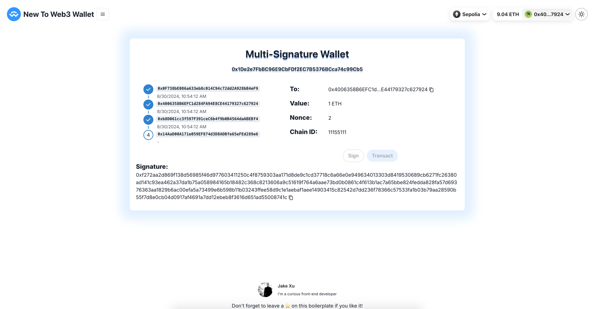

# Multi-Signature Wallet

IMO fancy hardware stuff is all overrated and most people should just store the bulk of their coins in a multisig (>= 5 participants) where most of the keys are held by trusted family and friends. **[--== From [vitalik.eth](https://twitter.com/VitalikButerin/status/1558886893995134978?s=20&t=4WyoEWhwHNUtAuABEIlcRw)
==--]]**

So let's use **Multi-Signature Wallet**.

[![solidity]][solidityURL]
[![remix]][remixURL]

## Features ⚡

- [x] [Demo contract](https://github.com/AmazingAng/WTF-Solidity/blob/main/50_MultisigWallet/MultisigWallet.sol)
- [x] Deploy script
- [x] Sign
- [x] Transact



---

## How to use 🤔

To get started with this boilerplate, you just need to follow these simple steps:

1. Deploy demo contract with script

   ```
   npx hardhat run --network sepolia scripts/multisig/deploy_multisig.js
   ```

2. Create postgres [storage on Vercel](https://vercel.com/docs/storage/vercel-postgres/quickstart)


3. Create tables and insert default data

   ```
   node scripts/multisig/seed.js
   ```
   
4. Operate and observe data changes to understand contract features
   >```typescript jsx
   >// 重点，直传hash在合约部分利用ecrecover检查签名会对不上 [{ message: txHash! }]
   >const hash = await signMessageAsync({ message: { raw: txHash! } })
   >```
### License

By [MIT licensed](../../LICENSE).

[solidity]: https://img.shields.io/badge/Solidity-000000?style=for-the-badge&logo=solidity&logoColor=FFFFFF
[solidityURL]: https://nextjs.org/
[remix]: https://img.shields.io/badge/Remix-007aa6?style=for-the-badge
[remixURL]: https://remix.ethereum.org/
