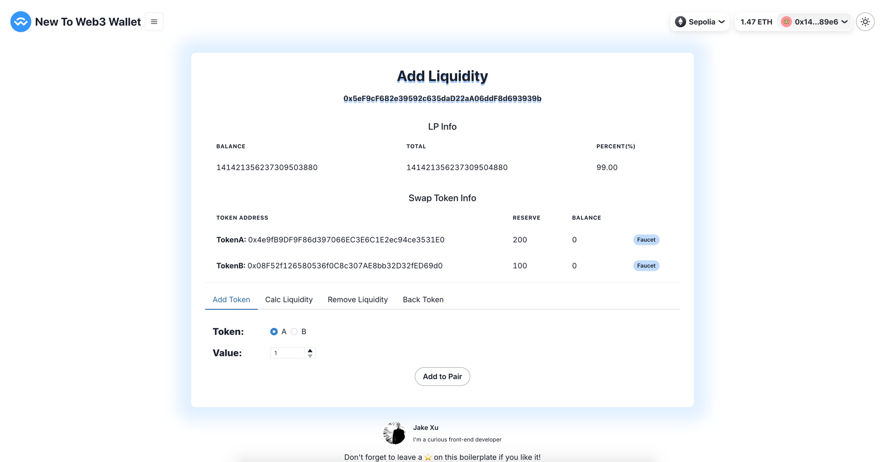

# Uniswap V2 - Add Liquidity

You can use `create2` to generate the contract address in advance. This demo will show you step by step.

[![solidity]][solidityURL]
[![remix]][remixURL]

## Features ⚡

- [x] Demo contract
- [x] Add Token
- [x] Calc Liquidity
- [x] Remove Liquidity
- [x] Back Token



---

## How to use 🤔

To get started with this boilerplate, you just need to follow these simple steps:

1. Connect to MetaMask in Remix


2. Deploy contracts on Remix


3. Move `.env.example` file to `.env` and add the values for the following keys:

   ```
    NEXT_PUBLIC_SEPOLIA_JTOKEN_A=
    NEXT_PUBLIC_SEPOLIA_JTOKEN_B=
    NEXT_PUBLIC_SEPOLIA_JSWAPFACTORY=
    NEXT_PUBLIC_SEPOLIA_UNISWAPV2PAIR=
   ```
4. Get a 2:1 tokens via the faucet button


5. Operate in order of tabs and observe data changes to understand contract features

### License

By [MIT licensed](../../LICENSE).

[solidity]: https://img.shields.io/badge/Solidity-000000?style=for-the-badge&logo=solidity&logoColor=FFFFFF
[solidityURL]: https://nextjs.org/
[remix]: https://img.shields.io/badge/Remix-007aa6?style=for-the-badge
[remixURL]: https://remix.ethereum.org/
