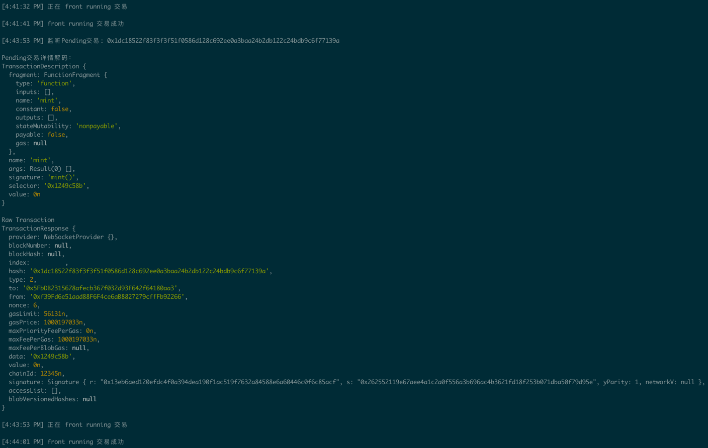
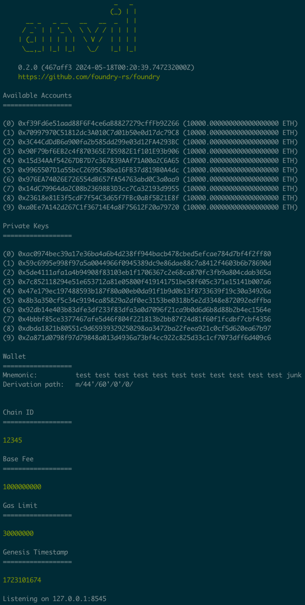
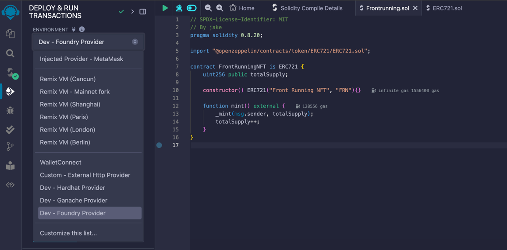

# Front-running

On-chain front-running refers to searchers or miners inserting their own transactions ahead of others by increasing `gas` or using other methods to capture value. In blockchain, miners can profit by packaging, excluding, or reordering transactions in the blocks they generate, and `MEV` is the measure of this profit.

[![solidity]][solidityURL]
[![foundry]][foundryURL]
[![ethers]][ethersURL]
[![remix]][remixURL]

## Features ⚡

- [x] Demo contract
- [x] Front-running script



---

## How to use 🤔

To get started with this boilerplate, you just need to follow these simple steps:

1. Start the Foundry local test chain:

   ```
   anvil --chain-id 12345 -b 20
   ```
   

2. Connect to Foundry provider:
   
   

3. Deploy demo contract with first account

4. Run locally by last account private key

   ```
   node scripts/frontrunning/frontrunning.js
   ```
   
5. Mint by first account
   > Then you will find that the currently mined NFT belongs to last account

### License

By [MIT licensed](./LICENSE).

[solidity]: https://img.shields.io/badge/Solidity-000000?style=for-the-badge&logo=solidity&logoColor=FFFFFF
[solidityURL]: https://nextjs.org/
[foundry]: https://img.shields.io/badge/Foundry-000000?style=for-the-badge&logo=foundry
[foundryURL]: https://getfoundry.sh/
[ethers]: https://img.shields.io/badge/Ethers-6790df?style=for-the-badge&logo=ethers
[ethersURL]: https://docs.ethers.org/v6/
[remix]: https://img.shields.io/badge/Remix-007aa6?style=for-the-badge
[remixURL]: https://remix.ethereum.org/
